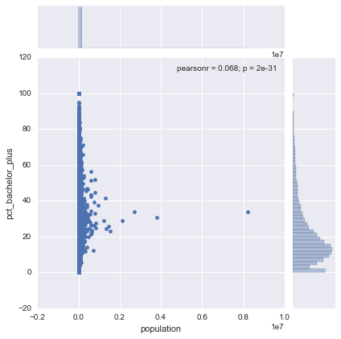
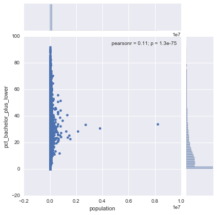
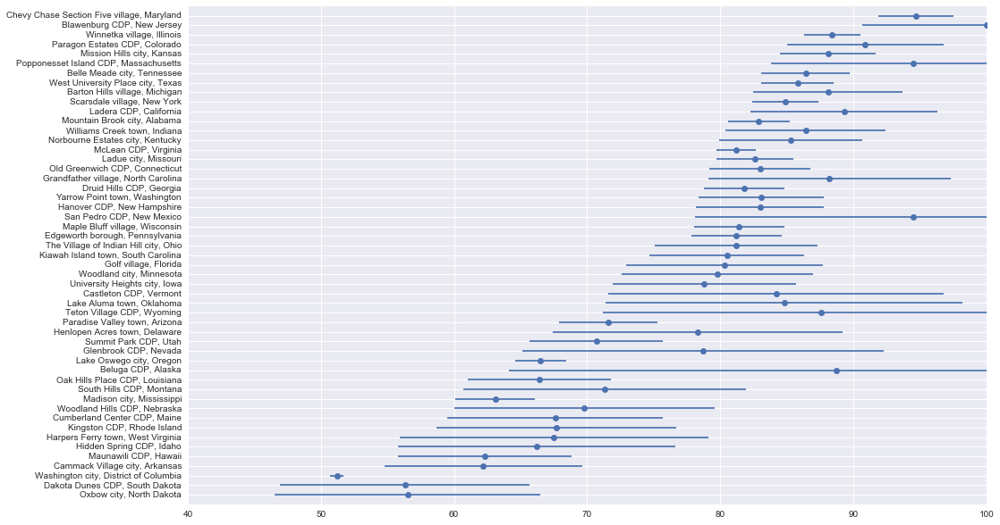
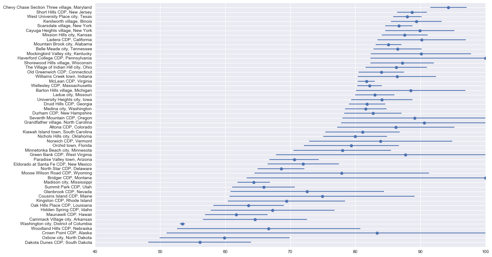

# The Most Educated Places in the U.S.

Earlier this week I came across an article on the [most educated places in the US](
http://www.businessinsider.com/most-educated-places-map-2014-9). I thought it would be cool to try to recreate their findings and expand upon by taking into account the uncertainty of the survey results.

Let's get started.

### Setup


```python
%matplotlib inline
```


```python
import matplotlib.pyplot as plt
import numpy as np
import pandas as pd
import requests
import seaborn as sns
import us
```

### Read data

We need two variables for each place in the US:
* Percent of population over 25 with a bachelor's degree or higher (called educational attainment from now on)
* Total population

We'll also grab the margin of error for these variables. We'll use them later.


```python
def state_and_place(df):
    """Extracts state and place from the original identification variable."""
    columns = (
        df
        .id
        .astype(str)
        .str.extract('(?P<state_fips>\d{1,2})(?P<place_fips>\d{5})', expand=True)
        .astype(int)
    )
    return df.join(columns)
```


```python
def read_acs(year):
    """Reads and formats ACS educational attainment data for a given year."""
    filename = '../data/ACS_{year}_5YR_S1501/ACS_{year}_5YR_S1501_with_ann.csv'.format(year=str(year)[-2:])
    
    na_values = ('**', '-', '+', '***', '*****', 'N', '(X)')

    variables = {
        'Id2': 'id',
        'Geography': 'place',
        "Total; Estimate; Percent bachelor's degree or higher": 'pct_bachelor_plus',
        "Total; Margin of Error; Percent bachelor's degree or higher": 'pct_bachelor_plus_moe'
    }
    
    return (
        pd
        .read_csv(
            filename,
            usecols=variables.keys(),
            na_values=na_values,
            # https://www.census.gov/geo/maps-data/data/tiger/char_encoding.html
            encoding='ISO-8859-1',
            skiprows=1
        )
        .rename(columns=variables)
        .pipe(state_and_place)
        .drop('id', axis=1)
        .set_index(['state_fips', 'place_fips'])
    )
```


```python
def read_population(year):
    """Collects and formats population data from the Census API for a given year."""
    url = 'http://api.census.gov/data/{}/acs5?get=B01003_001E,B01003_001M&for=place:*'.format(year)
    r = requests.get(url)
    data = r.json()
    
    columns = {
        'B01003_001E': 'population',
        'B01003_001M': 'population_moe',
        'state': 'state_fips',
        'place': 'place_fips'
    }
    
    return (
        pd.DataFrame(data=data[1:], columns=data[0])
        .rename(columns=columns)
        .apply(lambda s: s.astype(int))
        .set_index(['state_fips', 'place_fips'])
    )
```


```python
def state(df):
    """Converts state FIPS codes to state names."""
    data = (
        df
        .index
        .get_level_values('state_fips')
        .astype(str)
        .str.rjust(2, fillchar='0')
    )
    s = pd.Series(data=data, index=df.index)
    
    return s.apply(lambda x: us.states.lookup(x).name)
```


```python
def read_data(year):
    """Reads and formats desired ACS data for a given year."""
    acs = read_acs(year)
    population = read_population(year)
    
    return (
        acs
        .join(population)
        .assign(state=state)
        .set_index(['state', 'place'])
        .sort_index(axis=1)
    )
```


```python
df = read_data(2012)
```

### Let's check out the dataset

Whenever I work with a dataset for the first time I like to do a few things:
* Check out the shape/composition.
* Look at the top few rows.
* Look at the bottom two rows.
* Get a sense of how things are distributed.


```python
# Composition
df.info()
```

    <class 'pandas.core.frame.DataFrame'>
    MultiIndex: 29256 entries, (Alabama, Abanda CDP, Alabama) to (Wyoming, Y-O Ranch CDP, Wyoming)
    Data columns (total 4 columns):
    pct_bachelor_plus        29029 non-null float64
    pct_bachelor_plus_moe    29029 non-null float64
    population               29256 non-null int32
    population_moe           29256 non-null int32
    dtypes: float64(2), int32(2)
    memory usage: 914.2+ KB
    


```python
# Top
df.head()
```


<div>
<table border="1" class="dataframe">
  <thead>
    <tr style="text-align: right;">
      <th></th>
      <th></th>
      <th>pct_bachelor_plus</th>
      <th>pct_bachelor_plus_moe</th>
      <th>population</th>
      <th>population_moe</th>
    </tr>
    <tr>
      <th>state</th>
      <th>place</th>
      <th></th>
      <th></th>
      <th></th>
      <th></th>
    </tr>
  </thead>
  <tbody>
    <tr>
      <th rowspan="5" valign="top">Alabama</th>
      <th>Abanda CDP, Alabama</th>
      <td>0.0</td>
      <td>45.8</td>
      <td>42</td>
      <td>31</td>
    </tr>
    <tr>
      <th>Abbeville city, Alabama</th>
      <td>16.9</td>
      <td>5.7</td>
      <td>2699</td>
      <td>18</td>
    </tr>
    <tr>
      <th>Adamsville city, Alabama</th>
      <td>12.3</td>
      <td>3.9</td>
      <td>4537</td>
      <td>26</td>
    </tr>
    <tr>
      <th>Addison town, Alabama</th>
      <td>17.8</td>
      <td>10.5</td>
      <td>826</td>
      <td>284</td>
    </tr>
    <tr>
      <th>Akron town, Alabama</th>
      <td>7.9</td>
      <td>8.7</td>
      <td>369</td>
      <td>141</td>
    </tr>
  </tbody>
</table>
</div>


```python
# Bottom
df.tail()
```


<div>
<table border="1" class="dataframe">
  <thead>
    <tr style="text-align: right;">
      <th></th>
      <th></th>
      <th>pct_bachelor_plus</th>
      <th>pct_bachelor_plus_moe</th>
      <th>population</th>
      <th>population_moe</th>
    </tr>
    <tr>
      <th>state</th>
      <th>place</th>
      <th></th>
      <th></th>
      <th></th>
      <th></th>
    </tr>
  </thead>
  <tbody>
    <tr>
      <th rowspan="5" valign="top">Wyoming</th>
      <th>Woods Landing-Jelm CDP, Wyoming</th>
      <td>40.6</td>
      <td>17.7</td>
      <td>91</td>
      <td>102</td>
    </tr>
    <tr>
      <th>Worland city, Wyoming</th>
      <td>20.4</td>
      <td>3.9</td>
      <td>5426</td>
      <td>18</td>
    </tr>
    <tr>
      <th>Wright town, Wyoming</th>
      <td>14.3</td>
      <td>4.3</td>
      <td>2216</td>
      <td>382</td>
    </tr>
    <tr>
      <th>Yoder town, Wyoming</th>
      <td>15.9</td>
      <td>15.0</td>
      <td>149</td>
      <td>104</td>
    </tr>
    <tr>
      <th>Y-O Ranch CDP, Wyoming</th>
      <td>0.0</td>
      <td>16.1</td>
      <td>223</td>
      <td>109</td>
    </tr>
  </tbody>
</table>
</div>


```python
# Summary
df.dropna().describe()
```


<div>
<table border="1" class="dataframe">
  <thead>
    <tr style="text-align: right;">
      <th></th>
      <th>pct_bachelor_plus</th>
      <th>pct_bachelor_plus_moe</th>
      <th>population</th>
      <th>population_moe</th>
    </tr>
  </thead>
  <tbody>
    <tr>
      <th>count</th>
      <td>29029.000000</td>
      <td>29029.000000</td>
      <td>2.902900e+04</td>
      <td>29029.000000</td>
    </tr>
    <tr>
      <th>mean</th>
      <td>20.028689</td>
      <td>9.109429</td>
      <td>7.903848e+03</td>
      <td>190.236625</td>
    </tr>
    <tr>
      <th>std</th>
      <td>16.372341</td>
      <td>11.247205</td>
      <td>6.613706e+04</td>
      <td>221.437532</td>
    </tr>
    <tr>
      <th>min</th>
      <td>0.000000</td>
      <td>0.200000</td>
      <td>1.000000e+00</td>
      <td>0.000000</td>
    </tr>
    <tr>
      <th>25%</th>
      <td>9.100000</td>
      <td>4.000000</td>
      <td>3.460000e+02</td>
      <td>48.000000</td>
    </tr>
    <tr>
      <th>50%</th>
      <td>15.700000</td>
      <td>5.800000</td>
      <td>1.106000e+03</td>
      <td>123.000000</td>
    </tr>
    <tr>
      <th>75%</th>
      <td>26.000000</td>
      <td>9.200000</td>
      <td>4.100000e+03</td>
      <td>245.000000</td>
    </tr>
    <tr>
      <th>max</th>
      <td>100.000000</td>
      <td>100.000000</td>
      <td>8.199221e+06</td>
      <td>3536.000000</td>
    </tr>
  </tbody>
</table>
</div>


### Population vs. Attainment

We can see right away that we're dealing with some pretty heavily skewed data. Most places are teeny-tiny, while some are massive (I see you New York). Most also tend to have educational attainment rates (i.e., percent of the population over 25 with bachelor's degrees) around 10-20%, though some go all the way to 100%! More on that later.


```python
sns.jointplot('population', 'pct_bachelor_plus', data=df);
```





### Recreating the original metric

To make sure I'm starting off right, I wanted to try to recreate the original ranking. Fortunately the author was explicit with his methodology, so recreating was a breeze.


```python
colleges = (
    'Stanford CDP, California',
    'University at Buffalo CDP, New York',
    'University of Pittsburgh Johnstown CDP, Pennsylvania',
    'Mississippi State CDP, Mississippi',
    'St. Vincent College CDP, Pennsylvania',
    'University CDP, Mississippi'
)
```


```python
def highest_attainment_orig(df, filter_=True):
    """Gets the place with the higehst educational attainment in each state."""
    if filter_:
        # Only include places with at least 1,000 people, excluding colleges
        subset = df.loc[(df.population > 1000) & (df.index.map(lambda x: x[1] not in colleges))]
    else:
        subset = df
    # Find the place with the higehst attainment by state
    idx = (
        subset
        .groupby(level='state')
        .pct_bachelor_plus
        .transform('max')
        .eq(subset.pct_bachelor_plus)
    )
    
    return subset.loc[idx].reset_index('state', drop=True)
```


```python
(
    df
    .pipe(highest_attainment_orig)
    .pct_bachelor_plus
    .sort_values(ascending=False)
)
```


    place
    Chevy Chase town, Maryland                 92.7
    Ladera CDP, California                     89.3
    Winnetka village, Illinois                 88.4
    Mission Hills city, Kansas                 88.1
    Short Hills CDP, New Jersey                87.1
    Belle Meade city, Tennessee                86.4
    Lost Creek CDP, Texas                      86.3
    Scarsdale village, New York                84.9
    Castleton CDP, Vermont                     84.2
    Shorewood Hills village, Wisconsin         83.6
    Yarrow Point town, Washington              83.1
    Old Greenwich CDP, Connecticut             83.0
    Hanover CDP, New Hampshire                 83.0
    Mountain Brook city, Alabama               82.9
    Ladue city, Missouri                       82.6
    Druid Hills CDP, Georgia                   81.8
    The Village of Indian Hill city, Ohio      81.2
    McLean CDP, Virginia                       81.2
    Edgeworth borough, Pennsylvania            81.2
    Wellesley CDP, Massachusetts               80.8
    Pine Brook Hill CDP, Colorado              80.5
    Kiawah Island town, South Carolina         80.5
    Meridian Hills town, Indiana               79.5
    Indian Hills city, Kentucky                79.5
    University Heights city, Iowa              78.8
    Moose Wilson Road CDP, Wyoming             78.3
    East Grand Rapids city, Michigan           77.5
    Nichols Hills city, Oklahoma               76.9
    Fearrington Village CDP, North Carolina    76.0
    Key Biscayne village, Florida              76.0
    Sandia Heights CDP, New Mexico             73.6
    North Oaks city, Minnesota                 73.3
    Emigration Canyon CDP, Utah                71.8
    Paradise Valley town, Arizona              71.6
    Rehoboth Beach city, Delaware              68.9
    Kingston CDP, Rhode Island                 67.7
    Cumberland Center CDP, Maine               67.6
    Lake Oswego city, Oregon                   66.5
    Oak Hills Place CDP, Louisiana             66.4
    Hidden Spring CDP, Idaho                   66.2
    Madison city, Mississippi                  63.1
    Maunawili CDP, Hawaii                      62.3
    Goldstream CDP, Alaska                     57.7
    Dakota Dunes CDP, South Dakota             56.3
    Big Sky CDP, Montana                       54.3
    Shepherdstown town, West Virginia          51.4
    Goshen town, Arkansas                      51.3
    Washington city, District of Columbia      51.2
    Incline Village CDP, Nevada                47.6
    Wayne city, Nebraska                       44.4
    Fargo city, North Dakota                   39.0
    Name: pct_bachelor_plus, dtype: float64


Here's the original list, for comparison:


### The Problem: Uncertainty

One thing I was curious about was why the author decided to include only places with more than 1,000 people. What does this list look like if we include all places?


```python
(
    df
    .pipe(highest_attainment_orig, filter_=False)
    .sort_values('pct_bachelor_plus', ascending=False)
)
```


<div>
<table border="1" class="dataframe">
  <thead>
    <tr style="text-align: right;">
      <th></th>
      <th>pct_bachelor_plus</th>
      <th>pct_bachelor_plus_moe</th>
      <th>population</th>
      <th>population_moe</th>
    </tr>
    <tr>
      <th>place</th>
      <th></th>
      <th></th>
      <th></th>
      <th></th>
    </tr>
  </thead>
  <tbody>
    <tr>
      <th>Lakeview North CDP, Wyoming</th>
      <td>100.0</td>
      <td>85.6</td>
      <td>12</td>
      <td>19</td>
    </tr>
    <tr>
      <th>Gloster CDP, Louisiana</th>
      <td>100.0</td>
      <td>68.8</td>
      <td>20</td>
      <td>31</td>
    </tr>
    <tr>
      <th>Allen CDP, Maryland</th>
      <td>100.0</td>
      <td>24.6</td>
      <td>168</td>
      <td>170</td>
    </tr>
    <tr>
      <th>Zion CDP, Oklahoma</th>
      <td>100.0</td>
      <td>100.0</td>
      <td>2</td>
      <td>4</td>
    </tr>
    <tr>
      <th>Ocean CDP, Maryland</th>
      <td>100.0</td>
      <td>100.0</td>
      <td>7</td>
      <td>10</td>
    </tr>
    <tr>
      <th>Seconsett Island CDP, Massachusetts</th>
      <td>100.0</td>
      <td>65.6</td>
      <td>22</td>
      <td>26</td>
    </tr>
    <tr>
      <th>Prairie City CDP, South Dakota</th>
      <td>100.0</td>
      <td>100.0</td>
      <td>2</td>
      <td>3</td>
    </tr>
    <tr>
      <th>Bridger CDP, Montana</th>
      <td>100.0</td>
      <td>52.0</td>
      <td>53</td>
      <td>75</td>
    </tr>
    <tr>
      <th>Turtle Lake CDP, Montana</th>
      <td>100.0</td>
      <td>51.0</td>
      <td>70</td>
      <td>111</td>
    </tr>
    <tr>
      <th>Mendeltna CDP, Alaska</th>
      <td>100.0</td>
      <td>71.2</td>
      <td>19</td>
      <td>29</td>
    </tr>
    <tr>
      <th>Allamuchy CDP, New Jersey</th>
      <td>100.0</td>
      <td>37.3</td>
      <td>105</td>
      <td>137</td>
    </tr>
    <tr>
      <th>Blawenburg CDP, New Jersey</th>
      <td>100.0</td>
      <td>9.3</td>
      <td>515</td>
      <td>209</td>
    </tr>
    <tr>
      <th>Port Colden CDP, New Jersey</th>
      <td>100.0</td>
      <td>45.9</td>
      <td>45</td>
      <td>71</td>
    </tr>
    <tr>
      <th>Zarephath CDP, New Jersey</th>
      <td>100.0</td>
      <td>62.8</td>
      <td>72</td>
      <td>106</td>
    </tr>
    <tr>
      <th>Cobre CDP, New Mexico</th>
      <td>100.0</td>
      <td>64.7</td>
      <td>21</td>
      <td>33</td>
    </tr>
    <tr>
      <th>Lumberton CDP, New Mexico</th>
      <td>100.0</td>
      <td>74.1</td>
      <td>20</td>
      <td>41</td>
    </tr>
    <tr>
      <th>Manzano CDP, New Mexico</th>
      <td>100.0</td>
      <td>100.0</td>
      <td>7</td>
      <td>11</td>
    </tr>
    <tr>
      <th>Pinos Altos CDP, New Mexico</th>
      <td>100.0</td>
      <td>63.2</td>
      <td>22</td>
      <td>35</td>
    </tr>
    <tr>
      <th>Regina CDP, New Mexico</th>
      <td>100.0</td>
      <td>100.0</td>
      <td>5</td>
      <td>8</td>
    </tr>
    <tr>
      <th>Weed CDP, New Mexico</th>
      <td>100.0</td>
      <td>48.8</td>
      <td>37</td>
      <td>61</td>
    </tr>
    <tr>
      <th>Dering Harbor village, New York</th>
      <td>100.0</td>
      <td>100.0</td>
      <td>6</td>
      <td>9</td>
    </tr>
    <tr>
      <th>Paul Smiths CDP, New York</th>
      <td>100.0</td>
      <td>82.2</td>
      <td>600</td>
      <td>138</td>
    </tr>
    <tr>
      <th>Thousand Island Park CDP, New York</th>
      <td>100.0</td>
      <td>32.9</td>
      <td>77</td>
      <td>73</td>
    </tr>
    <tr>
      <th>Bellfountain CDP, Oregon</th>
      <td>100.0</td>
      <td>100.0</td>
      <td>15</td>
      <td>21</td>
    </tr>
    <tr>
      <th>Brush Creek CDP, Oklahoma</th>
      <td>100.0</td>
      <td>37.5</td>
      <td>69</td>
      <td>103</td>
    </tr>
    <tr>
      <th>Campo Verde CDP, Texas</th>
      <td>100.0</td>
      <td>92.0</td>
      <td>12</td>
      <td>18</td>
    </tr>
    <tr>
      <th>Little Orleans CDP, Maryland</th>
      <td>100.0</td>
      <td>82.2</td>
      <td>14</td>
      <td>20</td>
    </tr>
    <tr>
      <th>Lotsee town, Oklahoma</th>
      <td>100.0</td>
      <td>100.0</td>
      <td>3</td>
      <td>5</td>
    </tr>
    <tr>
      <th>Carmet CDP, California</th>
      <td>100.0</td>
      <td>85.1</td>
      <td>14</td>
      <td>19</td>
    </tr>
    <tr>
      <th>Oakville CDP, California</th>
      <td>100.0</td>
      <td>36.4</td>
      <td>76</td>
      <td>103</td>
    </tr>
    <tr>
      <th>...</th>
      <td>...</td>
      <td>...</td>
      <td>...</td>
      <td>...</td>
    </tr>
    <tr>
      <th>Remington CDP, Ohio</th>
      <td>89.7</td>
      <td>15.2</td>
      <td>199</td>
      <td>119</td>
    </tr>
    <tr>
      <th>Mission Woods city, Kansas</th>
      <td>88.5</td>
      <td>7.0</td>
      <td>175</td>
      <td>36</td>
    </tr>
    <tr>
      <th>Winnetka village, Illinois</th>
      <td>88.4</td>
      <td>2.1</td>
      <td>12210</td>
      <td>54</td>
    </tr>
    <tr>
      <th>Grandfather village, North Carolina</th>
      <td>88.2</td>
      <td>9.1</td>
      <td>85</td>
      <td>38</td>
    </tr>
    <tr>
      <th>Pippa Passes city, Kentucky</th>
      <td>88.2</td>
      <td>11.5</td>
      <td>605</td>
      <td>215</td>
    </tr>
    <tr>
      <th>Barton Hills village, Michigan</th>
      <td>88.1</td>
      <td>5.6</td>
      <td>286</td>
      <td>62</td>
    </tr>
    <tr>
      <th>University of Pittsburgh Johnstown CDP, Pennsylvania</th>
      <td>87.5</td>
      <td>70.3</td>
      <td>1453</td>
      <td>254</td>
    </tr>
    <tr>
      <th>Belle Meade city, Tennessee</th>
      <td>86.4</td>
      <td>3.3</td>
      <td>3016</td>
      <td>105</td>
    </tr>
    <tr>
      <th>Castleton CDP, Vermont</th>
      <td>84.2</td>
      <td>12.6</td>
      <td>1167</td>
      <td>271</td>
    </tr>
    <tr>
      <th>Henderson Point CDP, Mississippi</th>
      <td>84.0</td>
      <td>24.1</td>
      <td>50</td>
      <td>39</td>
    </tr>
    <tr>
      <th>Shorewood Hills village, Wisconsin</th>
      <td>83.6</td>
      <td>5.7</td>
      <td>1720</td>
      <td>81</td>
    </tr>
    <tr>
      <th>Hanover CDP, New Hampshire</th>
      <td>83.0</td>
      <td>4.8</td>
      <td>8608</td>
      <td>248</td>
    </tr>
    <tr>
      <th>Old Greenwich CDP, Connecticut</th>
      <td>83.0</td>
      <td>3.8</td>
      <td>6622</td>
      <td>431</td>
    </tr>
    <tr>
      <th>Mountain Brook city, Alabama</th>
      <td>82.9</td>
      <td>2.3</td>
      <td>20398</td>
      <td>30</td>
    </tr>
    <tr>
      <th>Ladue city, Missouri</th>
      <td>82.6</td>
      <td>2.9</td>
      <td>8524</td>
      <td>49</td>
    </tr>
    <tr>
      <th>Druid Hills CDP, Georgia</th>
      <td>81.8</td>
      <td>3.0</td>
      <td>14321</td>
      <td>743</td>
    </tr>
    <tr>
      <th>East Amana CDP, Iowa</th>
      <td>80.9</td>
      <td>43.7</td>
      <td>60</td>
      <td>52</td>
    </tr>
    <tr>
      <th>Kiawah Island town, South Carolina</th>
      <td>80.5</td>
      <td>5.8</td>
      <td>1448</td>
      <td>239</td>
    </tr>
    <tr>
      <th>Golf village, Florida</th>
      <td>80.3</td>
      <td>7.4</td>
      <td>291</td>
      <td>73</td>
    </tr>
    <tr>
      <th>Woodland city, Minnesota</th>
      <td>79.8</td>
      <td>7.2</td>
      <td>453</td>
      <td>94</td>
    </tr>
    <tr>
      <th>Glenbrook CDP, Nevada</th>
      <td>78.7</td>
      <td>13.6</td>
      <td>178</td>
      <td>105</td>
    </tr>
    <tr>
      <th>Henlopen Acres town, Delaware</th>
      <td>78.3</td>
      <td>10.9</td>
      <td>116</td>
      <td>32</td>
    </tr>
    <tr>
      <th>Keystone CDP, Nebraska</th>
      <td>76.1</td>
      <td>29.8</td>
      <td>109</td>
      <td>124</td>
    </tr>
    <tr>
      <th>Hansboro city, North Dakota</th>
      <td>75.0</td>
      <td>35.4</td>
      <td>12</td>
      <td>9</td>
    </tr>
    <tr>
      <th>Bluff CDP, Utah</th>
      <td>74.6</td>
      <td>20.2</td>
      <td>346</td>
      <td>134</td>
    </tr>
    <tr>
      <th>Watch Hill CDP, Rhode Island</th>
      <td>71.1</td>
      <td>13.9</td>
      <td>207</td>
      <td>91</td>
    </tr>
    <tr>
      <th>Cousins Island CDP, Maine</th>
      <td>68.4</td>
      <td>14.7</td>
      <td>615</td>
      <td>156</td>
    </tr>
    <tr>
      <th>Hidden Spring CDP, Idaho</th>
      <td>66.2</td>
      <td>10.4</td>
      <td>2077</td>
      <td>312</td>
    </tr>
    <tr>
      <th>Cammack Village city, Arkansas</th>
      <td>62.2</td>
      <td>7.4</td>
      <td>858</td>
      <td>186</td>
    </tr>
    <tr>
      <th>Washington city, District of Columbia</th>
      <td>51.2</td>
      <td>0.5</td>
      <td>605759</td>
      <td>0</td>
    </tr>
  </tbody>
</table>
<p>76 rows × 4 columns</p>
</div>


That's a lot of 100%s. One thing to notice is that the confidence interval for these places are massive. Zion CDP, Oklahoma, for example, has a 90% CI of [0, 100]. The interval includes every value this variable can take! While filtering these small, highly-uncertain places is a good heuristic, there are more robust ways to handle this isuse.

One way is to use the 90% least plausible value, defined as the value such that there is only a 10% chance the true parameter is lower. In other words, the smartest places, according to this procedure, are the places that are _most likely_ to have a high percentage of people with educational attainment. This works well because even if we completely overestimate the educational attainment rates we can be sure the top places are still on top.

The great thing about the [American Community Survey (ACS)](https://www.census.gov/programs-surveys/acs/about.html) is that they provide margins of error (MoE) for all of their estimate variables. Best of all, their MoE are for 90% confidence intervals. All we need to do is subtract the MoE from the estimate!

# A more conservative approach


```python
def lower_bound(df, column):
    """Gets the 90% confidence interval lower bound for a variable."""
    lower = df[column] - df['{}_moe'.format(column)]
    # Minimum value is 0
    lower.loc[lower < 0] = 0
    
    return lower
```


```python
def add_lower_bounds(df):
    """Adds the lower bounds for population and educational attainment."""
    return (
        df
        .assign(
            population_lower=lambda df: df.pipe(lower_bound, 'population'),
            pct_bachelor_plus_lower=lambda df: df.pipe(lower_bound, 'pct_bachelor_plus')
        )
    )
```


```python
df = df.pipe(add_lower_bounds)
```


```python
sns.jointplot('population', 'pct_bachelor_plus_lower', data=df);
```





You'll notice that the educational attainment distribution is even more skewed than before! This is because so many places are small and therefore have a lot of uncertainty associated with their estimates. These places will be unlikely to show up on our list (as they shouldn't).


```python
def highest_attainment(df):
    """Find the place with the higehst attainment by state, using the lower bound."""
    subset = df.loc[df.index.map(lambda x: x[1] not in colleges)]
    idx = (
        subset
        .groupby(level='state')
        .pct_bachelor_plus_lower
        .transform('max')
        .eq(subset.pct_bachelor_plus_lower)
    )
    
    return (
        subset
        .loc[idx]
        .reset_index('state', drop=True)
    )
```


```python
def plot_highest(df):
    """Creates an errorbar plot for attainment data."""
    highest = df.sort_values('pct_bachelor_plus_lower')

    plt.figure(figsize=(16, 10))
    plt.errorbar(
        highest.pct_bachelor_plus,
        np.arange(len(highest)),
        xerr=highest.pct_bachelor_plus_moe,
        fmt='o'
    )

    plt.xlim(40, 100)
    plt.ylim(-1, len(highest))
    plt.yticks(np.arange(len(highest)), highest.index)
```


```python
df.pipe(highest_attainment).pipe(plot_highest)
```





In the plot above we have the point estimate (the dot) and its confidence interval, ordered by the 90% least plausible value (i.e., the lower end of the CI). Compared to the original results, about half of the top places have changed.

### How do things look now?

The original data is a few years old. Let's see how things look with 2010-2014 data.


```python
df_14 = read_data(2014)
```


```python
df_14.pipe(add_lower_bounds).pipe(highest_attainment).pipe(plot_highest)
```





### Improvements

I don't think places are a good unit of analysis for this kind of work. Many are subsets of larger cities, which can be misleading.

An alternative would be to use metropolitian/micropolitan statistical areas and see how things change. The issue there is than smaller geographies are underrepresented (or not represented at all).

I'd like to try a hybrid approach: Use MSA where possible, otherwise use place. That allows us to acknowledge agglomeration effects, where applicable. I would need to find a mapping of places to MSAs. If that doesn't exist (quick Google search suggest it doesn't), I'd have to create one using Census TIGER shapefiles, which is easy to do with something like PostGIS or QGIS.

### Acknowledgements

Huge thanks goes to [Andy Kiersz](https://twitter.com/AndyKiersz), the author of the original article, for the inspiration.

Much of the discussion on uncertainty comes from [Cameron Davidson-Pilon's](https://twitter.com/Cmrn_DP) book [Bayesian Methods for Hackers](https://github.com/CamDavidsonPilon/Probabilistic-Programming-and-Bayesian-Methods-for-Hackers). Can't recommend it enough.
